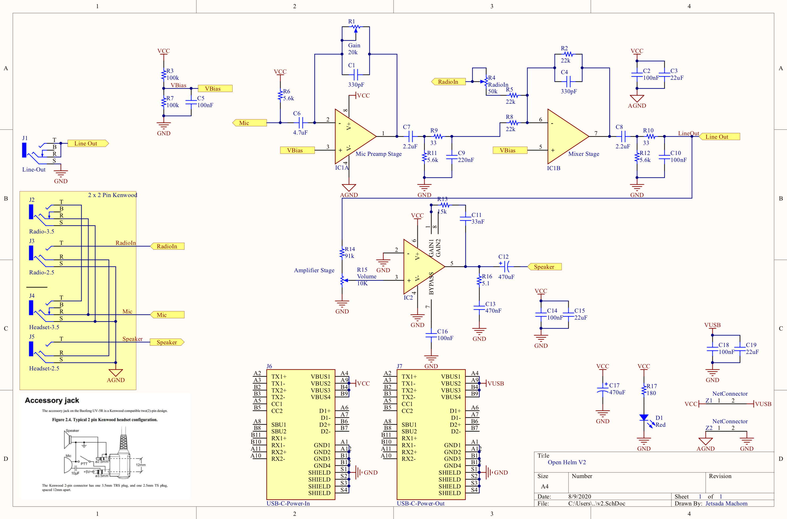
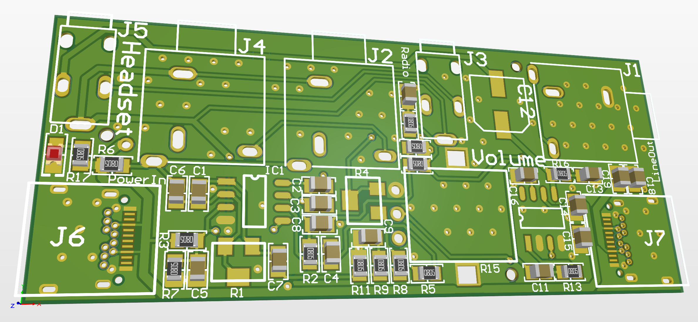
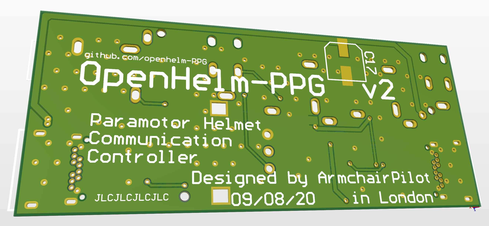
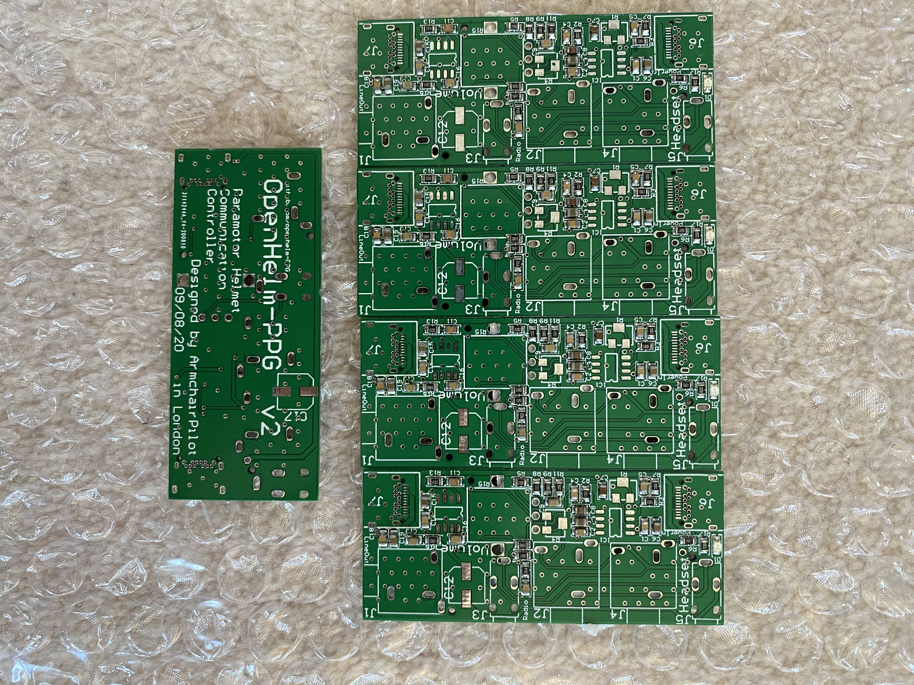
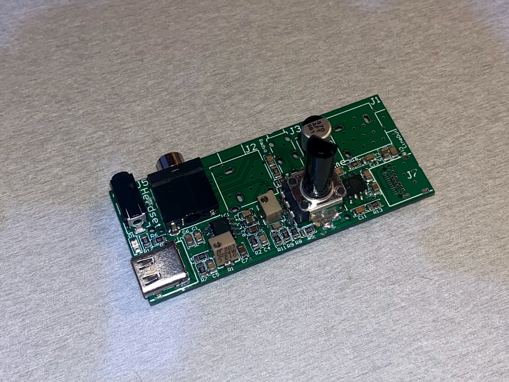
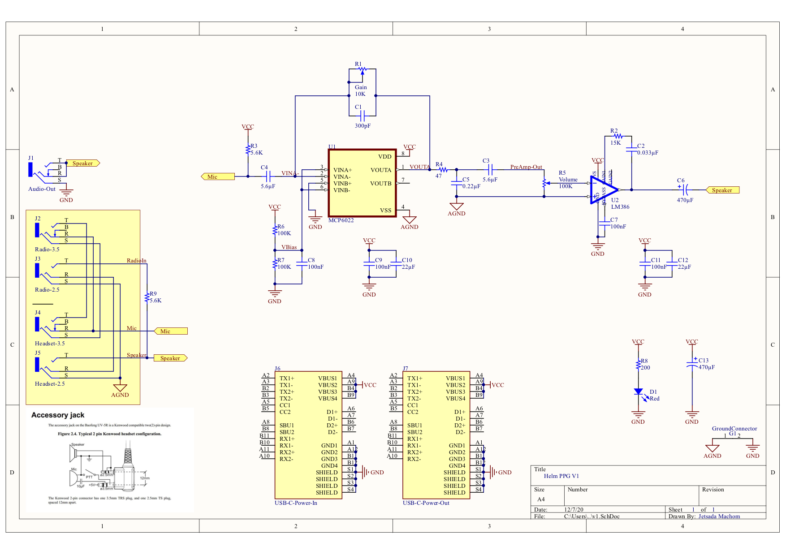
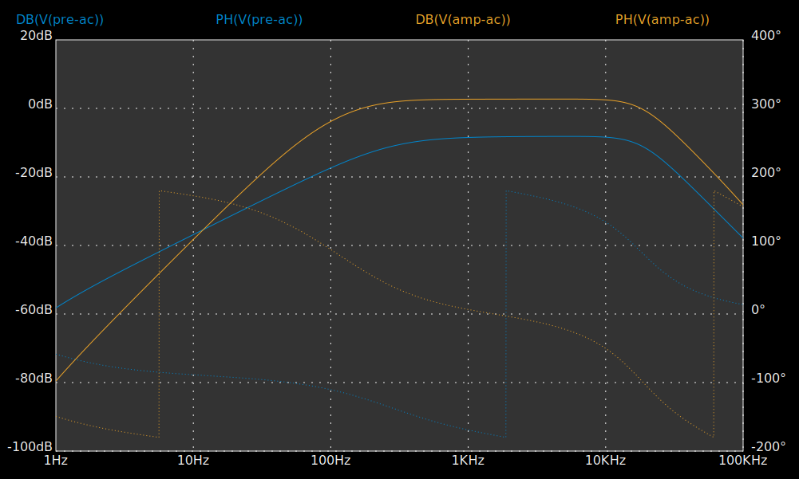
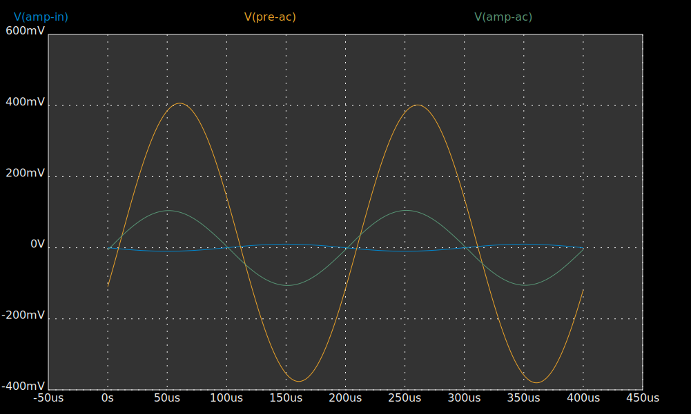
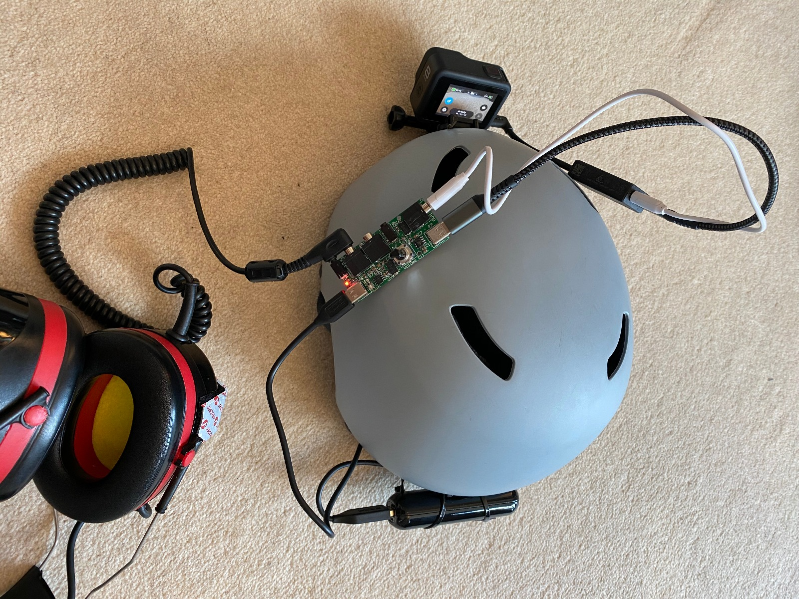
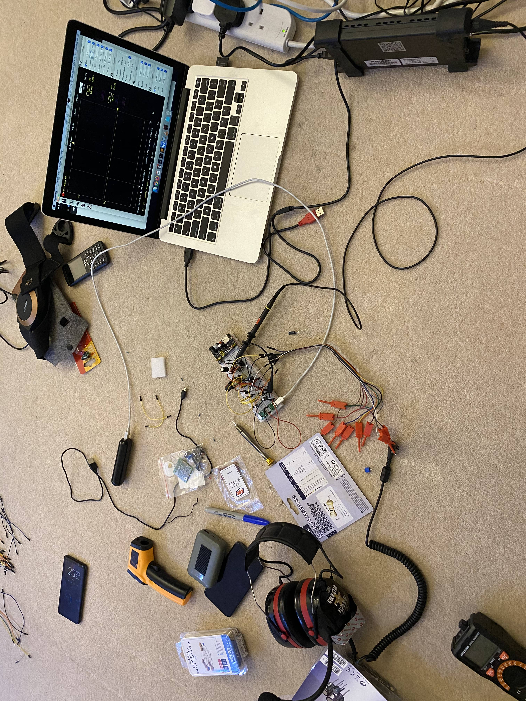

OpenHelm PPG
===
**An alternative communication solution on your helmet and headset for PPG pilot**
## Introduction
I found that the existing solution is either very expensive or involve too many components to achieve what I need, so I decided to start this project and make it open-source as my contribution to PPG community.

## v3 (09/11/20)
- Back to the design table consider swap the amplifier IC LM386 with modern amplifier

## v2 (09/08/20)
The design objective remain the same with v1, but this version is mainly to fix major in v1
- Fix amplifier oscillation
- Reduce power supply noise due to charging GoPro
- Fix Radio input mixing audio and add mixing gain POT

### update 09/11/20
I've got the PCB and soldered some components for testing

Unfortunately, we still have a major amplifier oscillation issue. I'm going back to the design table consider swap the amplifier IC LM386 with modern amplifier. Hopefully it should be able to handle low impedance load without hassle.

## v1 Design objective
- Record audio from 2 sources (Mic and Radio) to GoPro
- Sidetone with volume control
- Keep current my Kenwood 2pin headset unmodified
- While record GoPro audio you should not need to push Push-To-Talk button
- It should work normally with radio (eg. Push-To-Talk should work as normal)
- Single power source to power both this and charge GoPro

### Technical detail
- Schema

- Circuit simulation

- Gerber files [layers](v1/v1-layers.Cam) [drill](v1/v1-drill.Cam)

### Realworld product sneak peak :)

## backlog feature for next version
- Add bluetooth module

